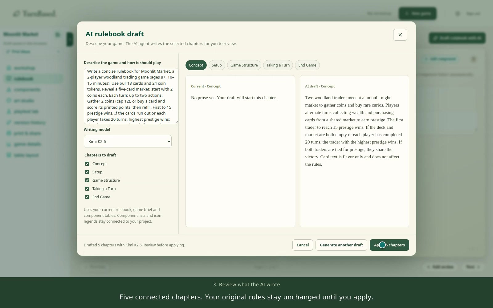

# TurnBased

A browser-based workspace for designing, playtesting, and printing board games.
Give the AI agent a game brief, review its draft rulebook, and develop the
components, artwork, and prototype in the same project.

**[Open TurnBased](https://turnbased.app)** ·
**[Watch the demo](https://turnbased.app/demo/turnbased-ai-rules.mp4)** ·
[Demo notes](docs/demos/ai-rules-ad.md)

[](https://turnbased.app/demo/turnbased-ai-rules.mp4)

## Product workflow

1. **Create a game.** Start locally with a working title or explore the included
   Little Woodland example. An account is optional for local authoring.
2. **Write the rules with AI.** Generate selected rulebook chapters from the
   game brief and existing components. Review the proposal before applying it;
   revise individual sections or undo the applied draft.
3. **Design the components.** Cards, boards, tokens, tiles, mats, and pieces
   share an editor for layers, front/back faces, and physical dimensions.
   Spreadsheet rows drive repeated designs, with AI suggestions for a column
   or individual cell.
4. **Test and revise.** Record findings, run the supported two-player lab,
   compare checkpoints, branch an experiment, and restore earlier designs.
5. **Export a prototype.** Download actual-size print sheets, a rulebook,
   or a portable project archive. Match components to supplier products and
   prepare an artwork package for manual ordering.

The [workshop guide](docs/workshop-guide.md) covers the complete workflow,
including duplex printing, large-board tiling, and supplier preparation.

## Engineering decisions

| Concern | Implementation |
| --- | --- |
| Data durability | Working drafts, workspace files, and immutable checkpoints use IndexedDB with content-addressed artwork. Checkpoints save locally before optional cloud synchronization. A shared five-second deadline bounds remote sync; failures leave the local checkpoint available. [Persistence contract](apps/web/src/editor/versions/README.md) |
| Recovery | Restoring a checkpoint first preserves unsaved changes in a safety checkpoint. Portable archives validate artwork hashes and checkpoint ancestry; imports receive a separate project and cloud history. [Archive implementation](apps/web/src/editor/versions/archive.ts) |
| Identity and access | Authenticated AI endpoints explicitly verify the caller's JWT. Database migrations define owner-scoped row-level security for projects, repositories, and usage-history reads. [Project policies](supabase/migrations/00000000000001_phase2_projects.sql) · [Rules endpoint](supabase/functions/ai-rules-writer/handler.ts) |
| AI integration | Provider credentials stay in server-side edge functions. Model selection, request limits, structured responses, and proposal validation are explicit. Browser apply/undo guards prevent delayed replies from replacing newer edits. [Rules workflow](apps/web/src/editor/sections/rules/README.md) · [Card-table API](supabase/functions/ai-card-table/README.md) |
| Usage accounting | AI handlers record model, token usage, provider cost, and customer charge. Card-table generation distinguishes reported cost from estimates and records invalid provider output without charging the designer. [Billing contract](supabase/functions/ai-card-table/README.md#billing-and-failures) |
| Service boundaries | React coordinates editor views; domain modules own project operations. A separate NestJS API owns supplier ingestion and quotes, backed by PostgreSQL, Prisma, Redis, and BullMQ. [Editor structure](apps/web/README.md) · [Catalog API](apps/catalog-api/README.md) |

## Repository

| Path | Responsibility |
| --- | --- |
| [`apps/web`](apps/web) | React, TypeScript, and Vite application; editor, local persistence, exports, and playtest lab |
| [`apps/catalog-api`](apps/catalog-api) | Supplier catalog, ingestion jobs, manufacturing layouts, and quotes |
| [`supabase/functions`](supabase/functions) | Authenticated AI integrations, remote project history, and supporting services |
| [`supabase/migrations`](supabase/migrations) | Versioned database schema, access policies, and usage accounting |
| [`packages`](packages) | Shared types, utilities, component schemas, and game-engine foundations |
| [`tests`](tests), [`scripts`](scripts) | Regression suites, local-stack tooling, browser checks, and demo recording |

See the [current architecture](.agents/architecture.md) and
[package-boundary decision](docs/adr/0001-monorepo-engine-boundaries.md).
Designs under [`docs/future`](docs/future) describe proposed work, not completed
product capabilities.

## Run locally

Requires **Node.js 22.12+** and **Docker with Compose v2**, with Docker running.
From the repository root:

```bash
npm run dev:local
```

The launcher installs dependencies, creates missing local environment files,
starts the catalog databases and API, applies migrations and seeds, then
starts Supabase, edge functions, and the web app at
**http://127.0.0.1:3000**. `npm run dev` runs the same launcher.

Choose **New game** or open **My workshop** and try **Little Woodland**.
Local authoring does not require an AI key. To use AI assistance, configure
`OPENROUTER_API_KEY` in the root `.env` and sign in with **Use local dev account**
on the local authentication screen. Provider calls incur usage charges.
A fresh catalog needs a [supplier refresh](apps/catalog-api/README.md#catalog-data).

Stop the launcher with `Ctrl+C`, then run `npm run dev:stop` to stop containers
while retaining database volumes. Full configuration and troubleshooting are
in the [development guide](docs/development.md).

## Verification and deployment

```bash
npm run test:dev         # Local-stack orchestration
npm run test:workshop    # Tables, templates, printing, and deterministic agents
npm run test:versions    # Persistence, archives, restore, and remote-sync failures
npm run test:production  # Supplier matching, quantities, ZIP and PNG output
npm run test:rules:api   # Rules generation, auth, model selection, and provider contracts
npm run test:cards:api   # Scoped AI edits, validation, auth, and usage accounting
npm run lint
npm run typecheck
npm run build
```

AI API tests use mocked providers and make no paid calls. GitHub Actions runs
the automated suites, lint, typechecking, and application builds on pull
requests and pushes to `main`; see the [workflow](.github/workflows/ci.yml).
Playwright checks exercise editing, reloads, checkpoint recovery, AI review,
tabletop interactions, and real export downloads against a running local app.
Browser setup and artifact locations are in the [verification guide](docs/verification.md).

Production configuration, release validation, and rollback are documented in
the [deployment guide](docs/deployment.md).

## Current boundaries

- **Authoring and execution are separate.** The AI drafts rulebook prose.
  The executable lab supports an explicit two-player market-race model with
  numeric costs and points. It does not interpret arbitrary rules or card
  abilities. Built-in agents are seeded heuristics; external agents can
  exchange validated JSON moves.
- **The working copy belongs to the browser.** Cloud checkpoint sync is
  optional. Export a portable archive before clearing browser storage or
  moving to another browser. Externally linked artwork still requires its
  source unless embedded in the project.
- **Supplier ordering requires a handoff.** Artwork packages support manual
  proof review and ordering. Integrated checkout, fulfillment, a marketplace,
  and general hosted multiplayer are not completed product flows.
- **Hosted supplier lookup is not connected.** Catalog lookup requires the
  separate catalog API; the local launcher includes it. See the deployment
  guide for the remaining hosted service configuration.
- **The catalog has an internal administration boundary.** Its administration
  routes have no application authentication and must remain behind a private
  gateway. See the [catalog deployment notes](apps/catalog-api/README.md#checks-and-deployment).
- **Hosted AI requires sign-in.** Metered features can require account credit;
  self-service payment and top-up flows are not part of this release.
